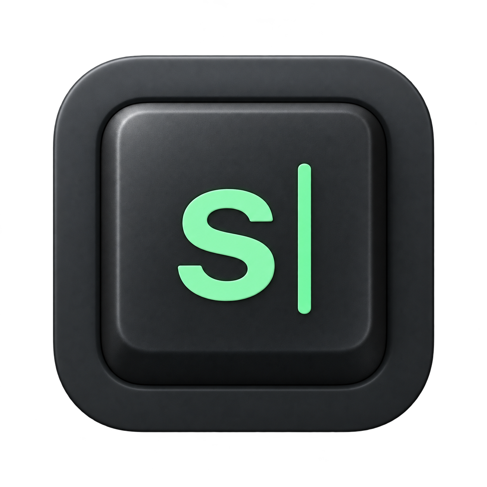

# Spellbound

A macOS spelling coach in early development that turns everyday typos into short typing exercises. Built around native SwiftUI app shells and shared Swift packages, with a future iOS practice app in mind.

## Try the prototype

Open **Spellbound** from Applications (installed at `/Applications/Spellbound.app`). A matching build is also available at **[dist/Spellbound.app](dist/Spellbound.app)** and choose **Open typing playground**. Type `This is neccessary ` (with a final space), then complete the word-anchored exercise.

For other apps, grant Accessibility once and enable monitoring in Spellbound. Cross-app support is experimental and depends on each control exposing text ranges and word coordinates. No per-app onboarding is required.

See [prototype usage and limitations](docs/prototype.md), [development setup](docs/development.md), and [compatibility evidence](docs/compatibility.md).

The native strip, guided/recall loop, playground, focused-input adapter, and guarded replacement are implemented. Per-word history and spaced review are still planned. Tuist owns project generation; shared Swift packages keep the core and views reusable on iOS.

## OpenSpec plan

- [Proposal](openspec/changes/macos-spelling-coach/proposal.md)
- [Architecture, decisions, scope, and sources](openspec/changes/macos-spelling-coach/design.md)
- [Implementation checklist](openspec/changes/macos-spelling-coach/tasks.md)
- [Capability requirements](openspec/changes/macos-spelling-coach/specs/)

Validate the proposal with the installed OpenSpec CLI:

```sh
openspec validate macos-spelling-coach --strict --no-interactive
openspec status --change macos-spelling-coach
```
